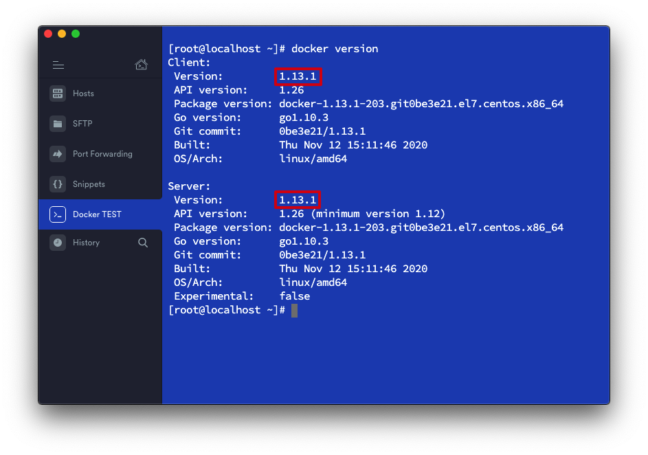
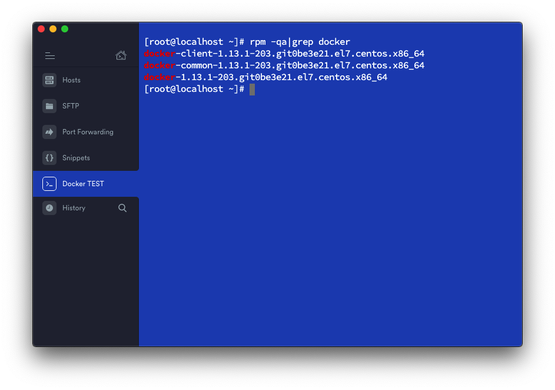
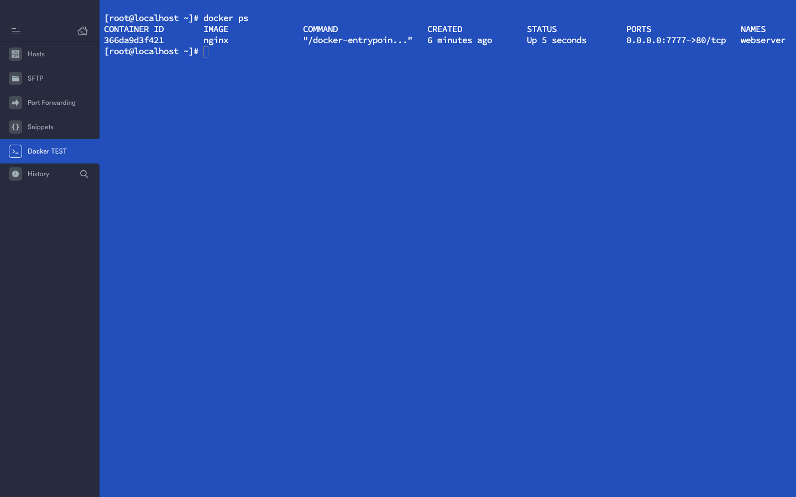

# Docker 紀錄

因公司基本上都以容器(Container)來啟動各種伺服器，所以來了解學習一下 Docker。

## 目錄

-

### 環境

- CentOS 7

### 安裝 Docker

#### 方法一：使用的指令如下(需要切換到 root 權限的使用者)

```shell
# yum install -y docker
```

#### 方法二：從網路上找 Docker rpm 安裝檔

```shell
# yum install https://www.testdomain.com/test.rpm
$ yum install [rpm address]
```

#### 確認版本

```shell
$ docker version
```



#### 啟動 Docker 的 service 指令如下

```shell
$ systemctl start docker
```

#### 開機自動啟動 `docker`

```shell
$ systemctl enable docker
```

#### 移除 Docker

- 先查詢 Docker 安裝了哪些服務

```shell
$ rpm -qa|grep docker
```



- 執行解安裝指令如下

```shell
$ yum remove docker-client
$ yum remove docker-common
$ cd /etc
$ rm –rf docker
$ cd /var/lib
$ rm –rf docker
```

### 使用 Docker 建立 Nginx 伺服器

使用官方 nginx image 運行 docker container

將 nginx image 跑起來成為一個 webserver container，並把 docker container 80 port 對應到本機端的 0.0.0.0:7777

```shell
$ docker run -d -p 7777:80 --name webserver nginx
```

若本地端沒有 image 則會從遠端下載：
Unable to find image 'nginx:latest' locally
latest: Pulling from library/nginx

檢查 Docker container 是否運行（有可能需要 sudo 權限）

```shell
$ docker ps
```

