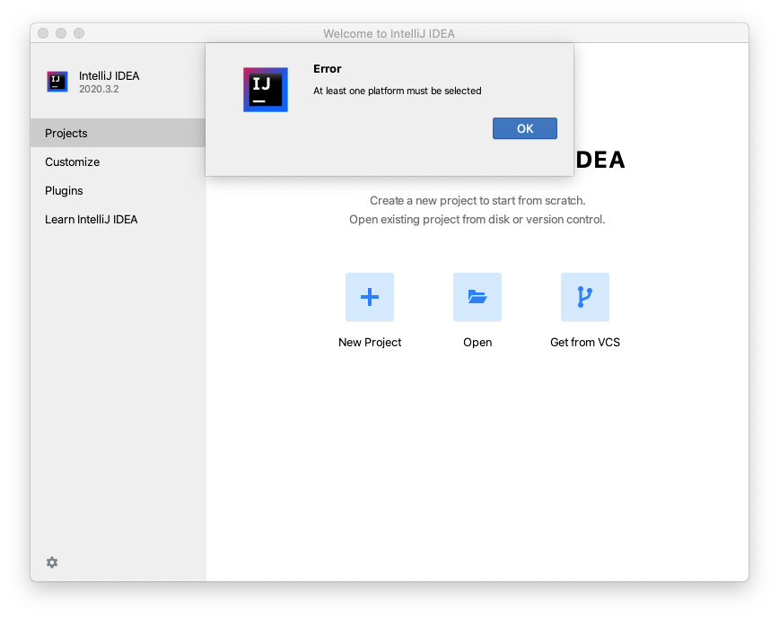
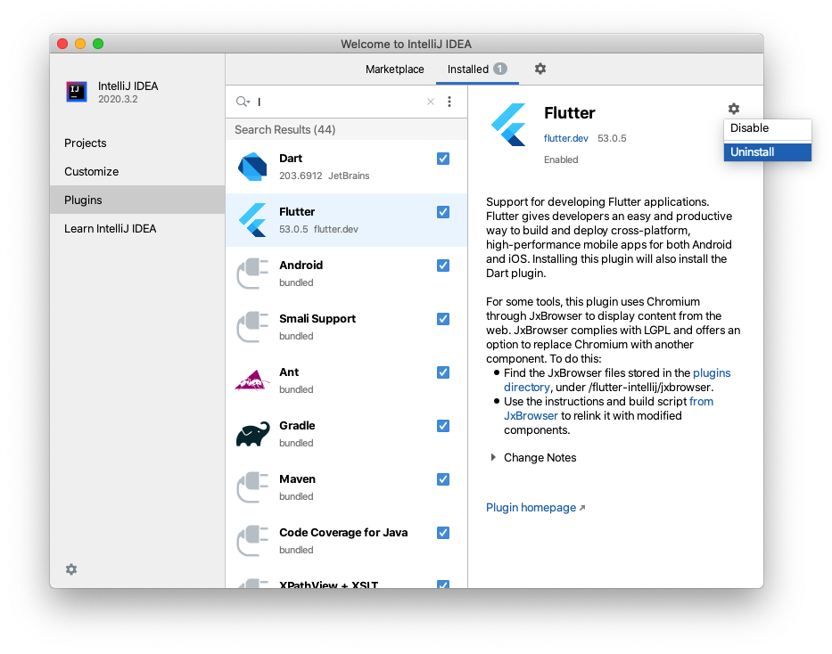
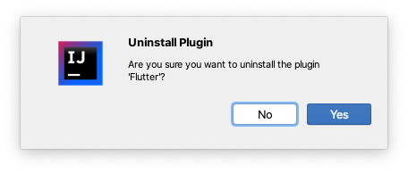
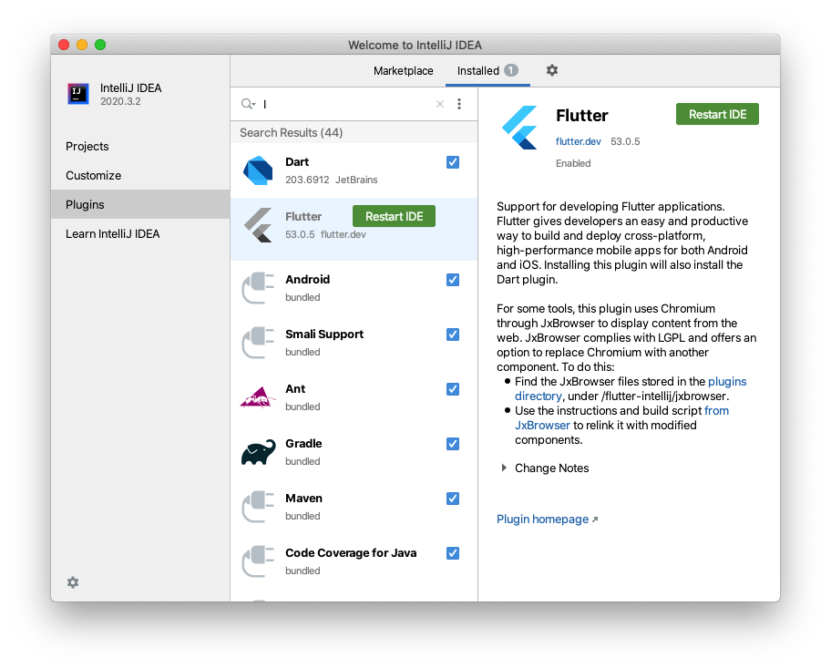
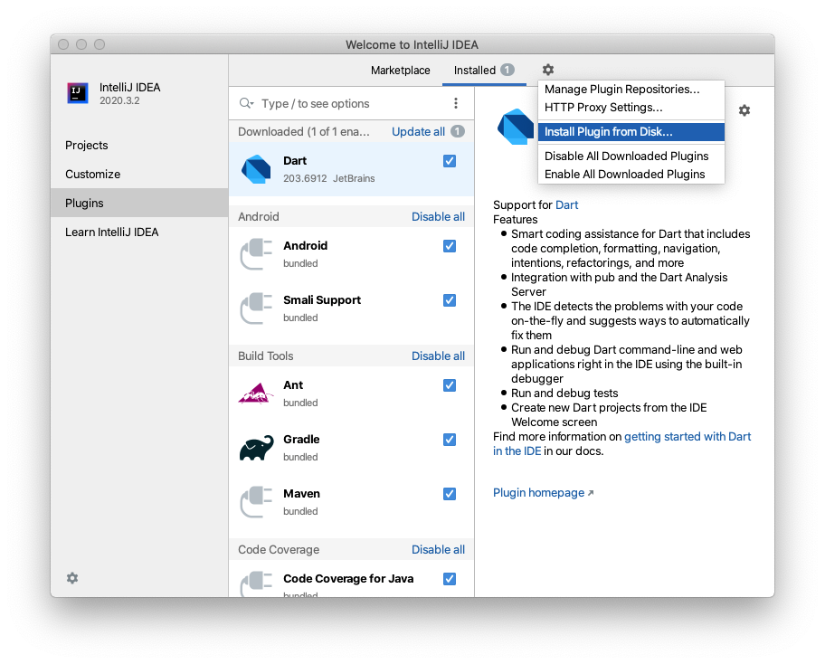
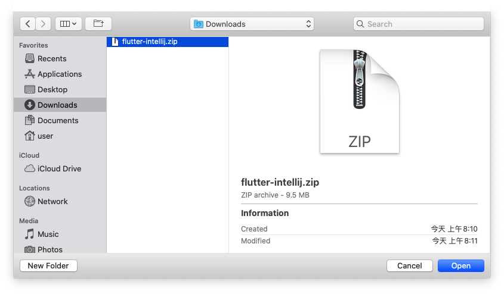
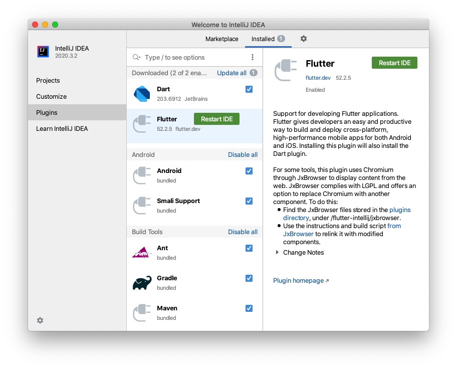

# IntelliJ IDEA 錯誤排除

## 目錄
- [At least one platform must be selected](#at-least-one-platform-must-be-selected.)
- [手動安裝 Plugin](#手動安裝-plugin)

---

### At least one platform must be selected.
這個是全新安裝 IntelliJ IDEA 之後，安裝了 `Flutter` Plugin 新開專案之後出現的：

這篇 [Github issues](https://github.com/flutter/flutter-intellij/issues/5230) 有許多人有一樣的問題
看起來問題是出在 `flutter` plugin 更新到 `53` 所導致
解決方式是手動降版本，或等官方修復。
> 52.2.5 下載地址：[https://plugins.jetbrains.com/plugin/9212-flutter/versions/stable/107560](https://plugins.jetbrains.com/plugin/9212-flutter/versions/stable/107560)

### 手動安裝 Plugin
以安裝 `flutter` 為例，首先解除安裝相關插件

確認

重新啟動

按下 IDE 上方的小齒輪，Install Plugin from Disk

選擇下載的安裝包

再次重啟

