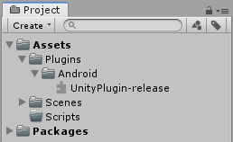

# 製作 Unity 的 Native Android Plugin
[前言請參考我](Unity-native-ios-plugin.md)
> Android Studio 版本不同可能按鈕位置不同，請尋找一下。

## 目錄
- [Library](#library)
  - [Android Studio](#android-studio-project)
  - [Unity](#unity-project)
  
---

## Library
這一個段落使用 Library 的形式製作。

### Android Studio Project
開啟 Android Studio 選擇 `Create New Project`。


練習用，這裡選擇 `No Activity` 視需求選擇


設定專案，選擇要儲存的地方，這裡的 `Minimim SDK` 要跟 Unity 的一樣。

   

在 Android Studio 中選擇 `File` > `New` > `New Module`。


選擇 `Android Library` 的類型


設定 Android Library


檢查 `Project` 中是否有 Library 的資料夾


打開 Library 資料夾下的 `build.gradle` 刪減剩下圖，並按同步按鈕：


找到以下路徑 UnityPlugin/src/main/java/`專案名稱` 新建 Java Class：


新的 Java Class 命名為 `BridgeController`，可以自行命名：


新增一個靜態的方法，讓 Unity 傳遞文字給這個方法，該方法回傳 bool 值：
```java
public static boolean PrintLog(String msg)
{
    Log.i("Unity", msg);
    return true;
    }
```

利用 Gradle 視窗 build ：


---

### Unity Project
新增一個測試用專案，並選好儲存位置，創建如下資料夾結構：


打開剛才 Android Studio 專案，找到剛才打包的 `aar` 文件，路徑如下：
> 專案資料夾\Library名稱\build\outputs\aar

將 `Library名稱-release.aar` 複製到 Unity : Assets\Plugins\Android：



新增 `BridgeController.cs` 腳本。作為與 Android Java 溝通的程式：
```csharp
using UnityEngine;

public class BridgeController : MonoBehaviour
{
    public static void PrintLog()
    {
        // Java Library package name + class name.
        using (AndroidJavaClass jc = new AndroidJavaClass("com.test.unityplugin.BridgeController"))
        {
            // 呼叫靜態方法
            if (jc.CallStatic<bool>("PrintLog", "Unity 送出的 Log"))
            {
                Debug.Log("Unity 收到方法回傳");
            }
        }
    }
}
```


接著新增 `Test.cs` 腳本，用來呼叫 BridgeController，並掛在 Camera 物件上：

```csharp
using UnityEngine;

public class Test : MonoBehaviour
{

    void Start()
    {
        BridgeController.PrintLog();
    }
}
```

Unity Build APK，並記得設定相關環境。


